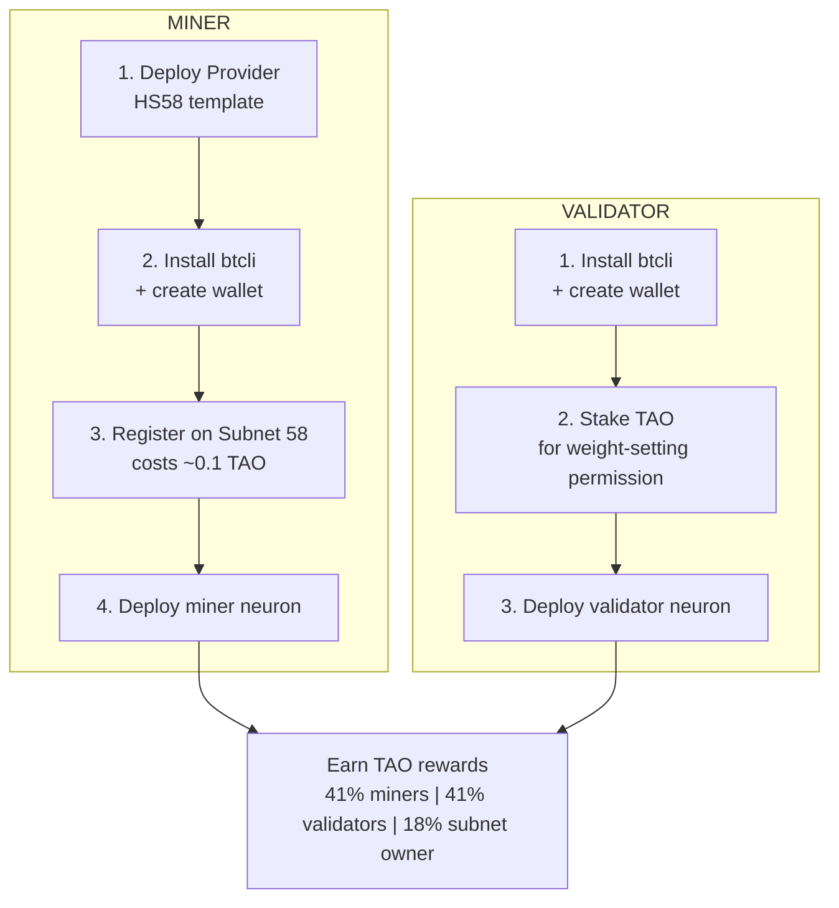

# Handshake58 - Bittensor Subnet 58

**DRAIN Protocol scoring for AI providers on Bittensor.**

Providers who deliver real AI service (proven by DRAIN micropayments) earn TAO rewards. No fake-able metrics — if agents pay, the service works.

---

## Miner vs Validator



---

## How It Works

```
Agent → pays per request via DRAIN vouchers → Provider
Provider → claims USDC on-chain → Polygon (DRAIN Contract)
Validator → scans ChannelClaimed events → scores Provider
Validator → sets weights on Bittensor → Provider earns TAO
```

## Scoring (2 Metrics)

| Metric | Weight | Source | Window |
|---|---|---|---|
| **DRAIN Claims** | 60% | ChannelClaimed events on Polygon | 7 days rolling |
| **Availability** | 40% | Synapse response with wallet proof | Current |

Normalization: Relative to top provider **within the same category** (e.g., LLM providers compete with LLMs, VPN with VPN). Categories are fetched from the Handshake58 marketplace API each validation round.

**Burn:** 90% of recycled TAO during registration is burned (set on-chain).

## Anti-Gaming

| Attack | Why it fails |
|---|---|
| Fake ChannelClaimed | Provider can't sign as consumer |
| Self-booking | Must deposit real USDC + pay gas |
| Claim without service | Consumer won't sign vouchers |
| Steal other's claims | Claims tied to provider address |
| Fake wallet ownership | ECDSA signature verification |

---

## Prerequisites

- **Python** >= 3.9
- **btcli** (Bittensor CLI): `pip install bittensor`
- **TAO** in your coldkey wallet (~0.1 TAO for miner registration, more for validator staking)
- **Polygon RPC URL** (recommended): [Alchemy free tier](https://www.alchemy.com/) for reliable event scanning

---

## Wallet Setup (Bittensor)

### Create a new wallet

```bash
# Install bittensor
pip install bittensor

# Create coldkey (stores your TAO)
btcli wallet new_coldkey --wallet.name my-miner

# Create hotkey (used for subnet registration)
btcli wallet new_hotkey --wallet.name my-miner --wallet.hotkey default
```

> **Save your mnemonics!** These are the only way to recover your wallet. Store them in a password manager or write them down securely.

### Fund your coldkey

Send TAO to your coldkey SS58 address. Check your address:

```bash
btcli wallet overview --wallet.name my-miner
```

You can buy TAO on exchanges like [MEXC](https://www.mexc.com/), [Gate.io](https://www.gate.io/), or [Bitget](https://www.bitget.com/).

---

## Run a Miner

### Step 1: Deploy a provider

First, you need an AI provider running. Pick a template from the [HS58 repo](https://github.com/Handshake58/HS58):

```bash
git clone https://github.com/Handshake58/HS58.git
cd HS58/providers/hs58-openai  # or any template
npm install && cp env.example .env
# Edit .env, then deploy on Railway (see HS58 README)
```

### Step 2: Register on Subnet 58

```bash
btcli subnet register --netuid 58 --wallet.name my-miner --wallet.hotkey default
```

This costs a small TAO recycle fee (typically 0.01-0.1 TAO depending on demand).

### Step 3: Configure miner environment

```bash
cp .env.example .env
```

Edit `.env`:
```bash
# Your Polygon wallet (receives DRAIN payments from agents)
POLYGON_WALLET=0x...
# Private key for wallet ownership proof (same wallet)
POLYGON_PRIVATE_KEY=0x...
# Your provider's API URL (the one you deployed in Step 1)
API_URL=https://your-provider.up.railway.app
# Optional: marketplace URL (default: https://www.handshake58.com)
MARKETPLACE_URL=https://www.handshake58.com
```

### Step 4: Run locally or deploy on Railway

**Local:**
```bash
pip install -e .
python neurons/miner.py --netuid 58 --wallet.name my-miner --wallet.hotkey default
```

**Railway (recommended):**
1. Fork this repo on GitHub
2. Go to [railway.app](https://railway.app) → New Project → Deploy from GitHub Repo
3. Select your fork — **no Root Directory needed** (repo root is the project)
4. Set **Service Type** to **Worker** (not Web) in Settings → Networking
5. Add environment variables (see below)
6. Deploy

### Railway Environment Variables (Miner)

```bash
# Bittensor wallet (base64-encoded files — see encoding instructions below)
BT_HOTKEY_B64=...
BT_COLDKEY_B64=...
BT_COLDKEYPUB_B64=...
WALLET_NAME=my-miner
HOTKEY_NAME=default

# Neuron type
NEURON_TYPE=miner

# Miner-specific
POLYGON_WALLET=0x...
POLYGON_PRIVATE_KEY=0x...
API_URL=https://your-provider.up.railway.app

# Optional
AXON_PORT=8091
AXON_EXTERNAL_PORT=443
```

### Base64-Encode Wallet Files

The Railway container decodes wallet files from environment variables at startup.

**Linux / Mac:**
```bash
BT_HOTKEY_B64=$(base64 -w 0 < ~/.bittensor/wallets/my-miner/hotkeys/default)
BT_COLDKEY_B64=$(base64 -w 0 < ~/.bittensor/wallets/my-miner/coldkey)
BT_COLDKEYPUB_B64=$(base64 -w 0 < ~/.bittensor/wallets/my-miner/coldkeypub)
```

**Windows PowerShell:**
```powershell
[Convert]::ToBase64String([IO.File]::ReadAllBytes("$env:USERPROFILE\.bittensor\wallets\my-miner\hotkeys\default"))
[Convert]::ToBase64String([IO.File]::ReadAllBytes("$env:USERPROFILE\.bittensor\wallets\my-miner\coldkey"))
[Convert]::ToBase64String([IO.File]::ReadAllBytes("$env:USERPROFILE\.bittensor\wallets\my-miner\coldkeypub"))
```

Copy each output string into the corresponding Railway env var.

The miner will:
- Sign a wallet ownership proof (ECDSA)
- Auto-register on the Handshake58 marketplace
- Respond to validator health checks

---

## Run a Validator

### Step 1: Register on Subnet 58

```bash
btcli subnet register --netuid 58 --wallet.name my-validator --wallet.hotkey default
```

### Step 2: Stake TAO

The validator needs stake for weight-setting permission:

```bash
btcli stake add --wallet.name my-validator --wallet.hotkey default --amount 100
```

> More stake = more influence. Check if you have VPERMIT:
> ```bash
> btcli subnets metagraph --netuid 58
> ```

### Step 3: Configure environment

```bash
cp .env.example .env
```

Edit `.env`:
```bash
# Alchemy Polygon RPC (recommended for reliable log queries)
POLYGON_RPC_URL=https://polygon-mainnet.g.alchemy.com/v2/YOUR_KEY
# Log query chunk size (Alchemy: 2000, public RPCs: 1000)
LOG_CHUNK_SIZE=2000
```

### Step 4: Deploy on Railway

1. Fork this repo → Railway → Deploy from GitHub → **Worker service**
2. Set environment variables:

```bash
BT_HOTKEY_B64=...
BT_COLDKEY_B64=...
BT_COLDKEYPUB_B64=...
WALLET_NAME=my-validator
HOTKEY_NAME=default
NEURON_TYPE=validator
POLYGON_RPC_URL=https://polygon-mainnet.g.alchemy.com/v2/YOUR_KEY
```

3. Base64-encode wallet files the same way as for the miner (see above)

The validator will:
- Query all miners for wallet proofs (availability check)
- Scan DRAIN `ChannelClaimed` events on Polygon (7-day window)
- Score miners: 60% claims + 40% availability
- Set weights on Bittensor

---

## Troubleshooting

### Registration

| Error | Solution |
|-------|----------|
| "Not enough balance" | Fund your coldkey with more TAO. Check: `btcli wallet balance --wallet.name my-miner` |
| "Subnet not found" | Subnet 58 may not exist yet. Check: `btcli subnets list` |
| "Already registered" | Your hotkey is already on the subnet — proceed to deployment |
| Coldkey password prompt | Our wallets are unencrypted. Just press Enter |

### Railway Deployment

| Error | Solution |
|-------|----------|
| "Wallet keys not configured" | Set `BT_HOTKEY_B64`, `BT_COLDKEY_B64`, `BT_COLDKEYPUB_B64` in Railway Variables |
| "SubstrateRequestException" | Bittensor network issue — service will retry automatically |
| Axon serve failure | Ensure `AXON_EXTERNAL_PORT=443` is set (Railway uses HTTPS) |
| Miner not found by validator | Check that `API_URL` in miner env points to a running provider |

### Claiming / RPC

| Error | Solution |
|-------|----------|
| "Rate limit exceeded" | Set `POLYGON_RPC_URL` to an Alchemy/Infura endpoint (free tier) |
| "ContractFunctionExecutionError" | Usually `InvalidAmount` — channel already claimed or balance is 0 |
| Log query timeouts | Reduce `LOG_CHUNK_SIZE` to 500 or 1000 |

---

## Architecture

```
HS58-subnet/
├── neurons/
│   ├── miner.py              # Miner entry point
│   └── validator.py           # Validator entry point
├── subnet58/
│   ├── __init__.py            # Version
│   ├── protocol.py            # ProviderCheck Synapse (3 fields)
│   ├── config.py              # Constants (DRAIN address, scoring weights)
│   ├── base/                  # Base classes (from Bittensor template)
│   │   ├── neuron.py
│   │   ├── miner.py
│   │   └── validator.py
│   ├── utils/
│   │   ├── config.py          # CLI args and config
│   │   └── misc.py
│   └── validator/
│       └── drain_scanner.py   # DRAIN event scanner (chunked, multi-RPC)
├── requirements.txt
├── setup.py
├── .env.example
├── Dockerfile
├── entrypoint.sh              # Decodes base64 wallet files, starts neuron
└── min_compute.yml
```

## DRAIN Protocol

**Contract:** `0x1C1918C99b6DcE977392E4131C91654d8aB71e64` (Polygon Mainnet)

The validator scans `ChannelClaimed(bytes32,address,uint256)` events to measure real provider usage.

## Related Projects

- [HS58](https://github.com/Handshake58/HS58) — Provider templates, docs, and hub
- [DRAIN Protocol](https://github.com/kimbo128/DRAIN) — Core protocol, smart contracts, SDK
- [Handshake58](https://www.handshake58.com) — Live marketplace

## License

[PolyForm Shield 1.0](https://polyformproject.org/licenses/shield/1.0.0/) — You can use, modify, and deploy this software for any purpose **except** building a competing product. See [LICENSE](LICENSE) for details.
